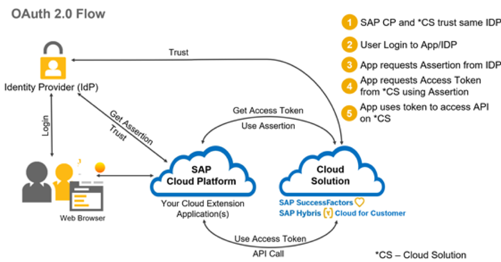
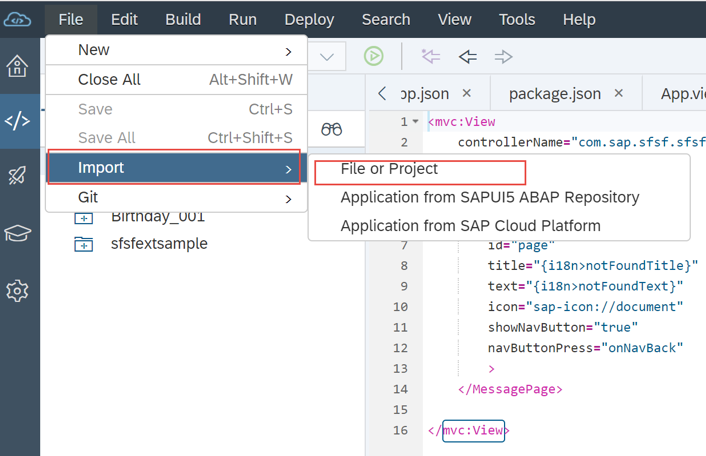
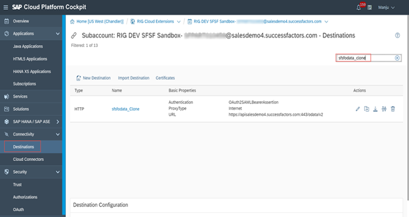
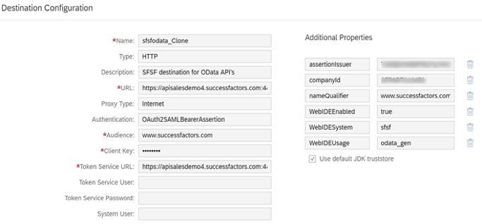

<a name="top"></a>

# Manage Security Configurations for Extensions Built on SAP Cloud Platform

This repository is for the TechEd 2018 Code Jam **CNA627**

## Table Of Contents

| Previous |
|---|
| [Introduction](#introduction) |
| [PART 1 - Deploy Sample Extension Application](#part-1---deploy-sample-extension-application) |
| [PART 2 - How Front-End Authentication Works](#part-2---how-front-end-authentication-works) |
| [PART 3 - How Back End Authentication Works](#part-3---how-back-end-authentication-works) |
| [PART 4 - How Authorization Works](#part-4---how-authorization-works) |
| [Reference Links](#reference-links) |

## Introduction

SAP Cloud Platform enables you to seamlessly integrate applications with existing identity management infrastructures. SAP Cloud Platform supports identity federation and single sign-on with external identity providers. In SAP Cloud Platform, identity information of a user is provided by identity providers (IdP), and user information is not stored on SAP Cloud Platform itself. You can have a different IdP for each SAP Cloud Platform subaccount you own, and this configurable is done in the SAP Cloud Platform cockpit.

The following graphic illustrates the high-level architecture of identity management in SAP Cloud Platform.

 

In this exercise we will mainly focus on security aspects of implementing an extension application on SAP Cloud Platform and guide you through the typical end to end development and configuration process. In order to demonstrate security concepts, this document content is focused around sample HTML5 application hosted on SAP Cloud Platform. In this session we will be using SAP SuccessFactors as a SaaS solution to highlight security and development aspects, but the concepts presented here should be applicable for any SAP LOB solution extension to most part.

Since extension applications differentiate by offering highly integrated experience with the extended system. The business users and administrators, using or managing such applications should be highly transparent and not incur additional complexity and effort.

### Single sign-on authentication in extension applications

Users should be able to access extension application the same way they access their LoB solutions without need for remembering additional user credentials. Single sign-on is one way to achieve seamless integration with existing infrastructure to manage access. Single sign-on (SSO) is a session/user authentication process that permits a user to enter one name and password in order to access multiple applications. The process authenticates the user for all the applications they have been given rights to and eliminates further prompts when they switch applications during a particular session

 

 SSO allows consistent user identity and access management. All company users are managed in single place. Same user id maps to the same person in all SSO enabled applications. It is easy for administrators to provision and de-provisioning user access.

### Landscape set-up
In this code jam, we will focus on enabling authentication which includes both front and backend authentication.  We have pre-configured landscape set-up to reduce configuration time, but we have provided all the necessary links to configure in your own environment.  Let’s spend some time in understanding various systems used for landscape set-up for this code jam session.
1. SAP Cloud Platform extension account created as result of technical on-boarding process. That is using SAP Cloud Platform extension package of SuccessFactors.
2. SuccessFactors tenant
3. SuccessFactors tenant configured as IDP for SAP Cloud Platform account – Pre-configured trust between SAP Cloud Platform account and SuccessFactors
4. Extension application deployed to SAP Cloud Platform account - In this session extension application is accessed from SAP Cloud Platform. Please note it is also possible to embed extension application into extended solutions

 

The above high-level architecture diagram depicts landscape set-up, various systems used and mostly importantly the flow.

### Front end Authentication

In SAP Cloud Platform, subaccounts get their users from identity providers. Administrators make sure that users can only access their dedicated subaccount by creating dedicated trust relationship between the identity providers and the respective subaccounts. Developers configure and deploy application-based security artifacts containing authorizations, and administrators assign these authorizations using the cockpit or dynamically via federated authorization.

 

SAP Cloud Platform supports several authentication methods between the end user and the app running on the SAP Cloud Platform: Form-based/SAML, Basic, Cert, BasicCert and OAuth. This list encompasses all the authentication methods on the platform, however you should still review the authentication method that is being offered for the service that you plan to use. Each service on the SAP Cloud Platform could have its own requirement.

 

Mostly commonly used authentication is form-based/SAML authentication method. This authentication method is implemented over the Security Assertion Markup Language (SAML) 2.0 protocol, so the authentication can be delegated to any identity provider that is SAML 2.0 compliant. The following security deployments are possible:
* SAP Cloud Platform Identity Authentication service
* Corporate user store
* 3rd party corporate identity provider

SAP ID service
 Please refer links in reference section towards end of the document on how to configure IDP for SAP Cloud Platform depending on your requirement.

### Back end Authentication

Typical hybrid applications that we develop on SAP Cloud Platform will consume some sort of service that may reside on-premise or in the cloud. Users of these applications need to be verified against the back-end system as well.

SAP Cloud Platform supports several authentication methods such as **NoAuthentication, BasicAuthentication, ClientCertificateAuthentication, AppToAppSSO, OAuth2SAMLBearerAssertion, PrincipalPropagation and SAPAssertionSSO** to enable user authentication to the back-end systems. The identity of the user between the SAP Cloud Platform and back-end system should be the same when accessing the system to achieve single sign on.

 

Authentication to backend is defined on SAP Cloud Platform using Connectivity destinations.  Destinations are part of SAP Cloud Platform Connectivity service and are used for the outbound communication of a cloud application to a remote system. They contain the connection details for the remote communication of an application. Connectivity destinations are represented by symbolic names that are used by on-demand applications to refer to remote connections. The connectivity service resolves the destination at runtime based on the symbolic name provided.

**SAP Cloud Platform Destination Authentication Methods**

 

In this exercise we are going to focus more on OAuth2SAMLBearerAssertion type of backend authentication.   Please refer links in reference section below on how to configure various other authentication types to enable SSO to backend systems. The main criteria for deciding backend authentication mainly depends on your requirement and backend system support to implement one of the above techniques.

### Overview - OAuth 2.0

Let’s spend some time to understand what OAuth 2.0 is and why OAuth 2.0 before we deep dive into configuration aspects. OAuth has taken off as a standard way and a best practice for applications and websites to handle authorization. OAuth defines an open protocol for allowing secure API authorization of desktop, mobile and web applications through a simple and standard method.

OAuth is based on granting access without explicit credentials sharing. OAuth:
* Avoids storing credentials at the third-party location
* Limits the access permissions granted to third parties
* Enables easy access right revocation without the need to change credentials

In this way, OAuth mitigates some of the common concerns with authorization scenarios.

The following table shows the roles defined by OAuth, and their respective entities in SAP Cloud Platform:

 

### OAuth2SAMLBearerAssertion

SAP Cloud Platform provides support for applications to use the SAML Bearer assertion flow for consuming OAuth-protected resources. In this way, applications do not need to deal with some of the complexities of OAuth and can reuse existing identity providers for user data. Users are authenticated by using SAML against the configured trusted identity providers. The SAML assertion is then used to request an access token from an OAuth authorization server. This access token is automatically injected in all HTTP requests to the OAuth-protected resources.

 

Click [here](https://help.sap.com/viewer/cca91383641e40ffbe03bdc78f00f681/Cloud/en-US/e51e152ceaeb4b75affe5f15c65dfe6c.html) for further details on OAuth2SAMLBearerAssertion.

## PART 1 - Deploy Sample Extension Application

In this section, we will develop and deploy simple extension application which consumes OData API from SAP SuccessFactors solution.  Using this sample extension application, we try to understand how authentication and authorization on SAP Cloud Platform.

 

1. On-board to SAP Cloud Platform account using QR barcode provided by instructor during the session.

    Once the on-boarding process is complete you should have access to SAP Cloud Platform account.

    URL: https://bit.ly/2M4z52c

    

    **Note**: - You need to have S, P,D,C or I user in order to complete on-boarding process

2. Open the SAP Cloud Platform link.

    Now you should have access to SAP Cloud Platform account. If not please complete step 1, before proceeding to next step.

    URL: https://account.us2.hana.ondemand.com/cockpit#/globalaccount/5fc747b0-4586-4e0b-8ab8-b61c5be5a923/subaccounts

    

3. Navigate to Services tab on the left-hand side and search for WEB IDE as shown in the screen shot.

    Select SAP Web IDE Full Stack from the list.

    

4. Check if **SAP Web IDE Full-Stack** service is **enabled** or not

    **Note**:-If the SAP Web IDE Full-Stack service *is not enabled*, then **click the tile and enable the service** by clicking on the Enable button (blue button).

    

5. Open SAP Web IDE Full Stack.

    

6. This will open up the Web IDE Full Stack Editor.

    

7. Let’s import sample project by choosing File ->Import ->File or Project on the development space page.

    We are importing sample extension application which was created ahead of time.

    Location: https://bit.ly/2KAVchi

    

    **Note**: - Your Instructor will provide the sample extension app zip file or location to sample extension app.

8. Browse the folder for application provided by your instructor

    While import application, provide workspace id as suffix provided by your instructor.
    Ensure to maintain the application name prefixing sfsfextsample

    ```
    e.g.: sfsfextsample_000
    ```

    Click OK

    

9. You should see application imported into your workspace

    

10. Change the app id in the `manifest.json` file (under webapp folder) as shown in the screenshot.

    

11. Navigate to your application web app folder and click on index.html file

    


12. Run the preview by clicking on the    button.

    

13. When prompted enter SuccessFactors user credentials provided by your instructor.

    SuccessFactors tenant URL will be provided by your instructor during the session.

    ```
    Username: devuserXXX
    Password: <use pwd provided by instructor >
    ```

    

14. You will see application output displayed as shown in the screen shot.

    

15. Let’s deploy sample application to SAP Cloud Platform after unit testing.

    

16. When prompted for login, use S, D,C, P or I user id that was used during on-boarding process to SAP Cloud Platform account in [Part1](#part-1---deploy-sample-extension-application) - Step 1.

    


17. Click on Deploy

    Select Deploy to new application as indicated in the screenshot

    Ensure to maintain the app name as sfsfextsampleXXX

    **Replace XXX with a 3digit number of your choice**

    

18. White list extension apps – In order to execute application directly from SAP Cloud Platform, we need create ACS entry on SuccessFactors side, so that extension application is trusted by IDP.

    **Notes**: -

    * This step is specific to SuccessFactors extensions.
    * This is step can be skipped since it is already pre-configured with wild card entries for all trial accounts.

        Even though SAML SSO is configured by default for SAP  Cloud Platform extension accounts, for security reasons the SuccessFactors Identity Provider will not accept authentication requests coming from all sources. If your application is not registered in SuccessFactors Identity Provider as Authorized Assertion Consumer Service, after login you will get blank screen. In order to resolve this, you need to register the application in SuccessFactors Identity Provider. Follow the documentation link   to learn more about configuration.
        ACS entries can be created by manually or using SAP Cloud Platform neo command. For manual option you need to have access to SuccessFactors provisonining account.
        For executing neo command you need to have SAP Cloud Platform neo SDK installed on your laptop.

        neo hcmcloud-enable-application-access --application `sfsfextsampleXXX` --application-type html5 --account dfa8f16d8 --user `<P or S user>` --host us2.hana.ondemand.com

        Replace highlighted values before executing neo command.


### Summary

In this section you have learned how to deploy sample extension and got an high level understanding of  how authenciation works with SAML idenity provider.

## PART 2 - How Front-End Authentication Works

SAP Cloud Platform applications can delegate authentication and identity management to an existing corporate IdP that can, for example, authenticate your company's employees. It aims at providing a simple and flexible solution: your employees (or customers, partners, and so on) can single sign-on with their corporate user credentials, without a separate user store and subaccount in SAP Cloud Platform. All information required by SAP Cloud Platform about the employee can be passed securely with the logon process, based on a proven and standardized security protocol. There is no need to manage additional systems that take care for complex user account synchronization or provisioning between the corporate network and SAP Cloud Platform.


### SAML FLOW

* User accesses protected web resource on SP “Service Provider” i.e. SAP Cloud Platform
* SAP Cloud application sends SAML Authentication Request via HTTP redirect to trusted IdP
* IdP authenticates the user (if not done already). Upon successful authentication, IdP sends an HTML form with the SAML Response message in a hidden field to the Web Browser. It contains the user’s ID and (optionally) additional user attributes (e.g. first name, last name, e-mail, group memberships, …)
* User is created based on information in the SAML Response

Please refer links in reference section on how to configure SAML compliant IDP for SAP Cloud Platform.

1.	Logon to the SAP Cloud Platform cockpit and navigate to Security->Trust

    Under Application Identity provider tab you will notice default IDP configured for this extension account.

    **Note**: - Please note this step is already configured for sake of time. For this session, we have used SuccessFactors as an IDP for demonstration purpose, you can configure any SAML provider of your choice as an IDP.

    

2. Two Way trust is created between SAP Cloud Platform extension and SAP SuccessFactors

    

3. If you’re wondering why SuccessFactors login page was prompted when extension application or services are accessed-  That’s because the SuccessFactors is configured as trusted IDP for this SAP Cloud Platform account as part of technical on-boarding process.

    * SuccessFactors acts as Identity Provider and SAP Cloud Platform extension account   as Service Provider.
    * The Service Provider configuration is used by all Java and HTML5 extension applications deployed to this account for authentication against the SuccessFactors Identity Provider.
    * For SuccessFactors this configuration comes out of the box with SAP Cloud Platform extension package, you do not have to perform additional configuration.
    * Check reference links section for details steps to configure SAML IDP provider of your choice.

4. Navigate to Service Tab, click on Web IDE Full Stack

    

5. As soon you click on link of SAP Web IDE full Stack, you will be prompted to enter SuccessFactors user credentials.

    

### Summary
In this  section, you learned how a SAML based authenication / Single Sign-On (SSO) service works which  enables users to log on only once and get seamless access to all your applications deployed using SAP Cloud Platform.

## PART 3 - How Back End Authentication Works

Now that application is deployed and working, let’s try to understand how OData API was executed to fetch data from SuccessFactors and how the backend authentication worked. The destination used by this application was pre-configured to save time.
The authentication method used by extension application to consume OAuth protected API on SuccessFactors is **OAuthSAMLBearerAssertion**. OAuth 2.0 defines an authorization protocol for protected API resources.
To ensure that applications are allowed to act on behalf of users, OAuth 2.0 relies on 'access tokens'. To access protected resources, consumer applications must obtain 'access tokens'. The OAuth 2.0 specification defines the various ways that applications can request and use access tokens.


1. OAuth configuration

    In order to achieve principal propagation to backend system, when making API calls, it is required that single sign-on is configured for the extension application. This step is already pre-configured as described in Section 2 of Front Authentication.

    OAuth 2.0 SAML Bearer assertion configuration for extension application is a two-step process.

    1. OData API OAuth Client application is registered in SuccessFactors for your extension: As “X.509 Certificate” for the application registration, uses your extension account Local Service Provider Signing Certificate (Account->Trust->Local Service Provider->Signing Certificate).  In case of SuccessFactors this step can be automated by simply executing  using neo command which is part SucessFactors extension package. For other LoB solutions this step be manual step, So please check respective extension application configuraiton.

    2. SAML Bearer Assertion Destination is created in SAP Cloud Platform for your application.  As shown in step 4 below.


2. For detailed step-by-step instructions for set-up, please refer [on-line documentation](https://help.sap.com/viewer/cca91383641e40ffbe03bdc78f00f681/Cloud/en-US/e51e152ceaeb4b75affe5f15c65dfe6c.html).

3. 3.	Logon to the cloud cockpit and navigate to destinations tab on the left.

    Search for **"sfsfodata_clone"** destination on the right.

    In neo-app.json, you can check **"sfsfodata_clone"** destination used by this extension application.

    

4. Destination configuration

   You can see all the connection parameters defined for OAuth2SAMLBearerAssertion authentication type.

    

5. Backend Authentication flow to access OData API.

    

6. Here is how OAuth flow works.

    


### Summary

In this section you understood high level configuration steps required to configure OAuth2SAMLBearerAssertion authentication method on SAP Cloud Platform to enable principal propagation to consume OData  API calls on behalf on logon user.

## PART 4 - How Authorization Works

Authentication mainly address validating users who can access the system i.e. mainly to validate your identity whereas authorization address who can access resources, application and what they can see after successful authentication. Developers configure these authorizations on the level of the application descriptor files so that security artifacts are available in the cockpit. Administrators use the security artifacts to build roles and aggregate them into role collections (sets of authorizations that are suitable for distinct user groups). Security artifacts enable applications to communicate with other applications, for example, making or receiving calls.   Here is the complete list of options available to developers to add security artifacts to the extension application.

### Local Authorization Models in SAP Cloud Platform - Neo environment


When developing SAP Cloud Platform Extension Applications, we must take into consideration the design the application authorization model. We have to define, the roles of the application users and the associated permissions needed for those roles.
Roles can be maintained either on SAP Cloud Platform or SAP LoB solution that your extending.  By default, SAP Cloud Platform is the default role provider where in roles has to be assigned to users statically or dynamically via federated authorization.  Even some of the SAP LoB solutions provides API’s for accessing role model.

**Note**: - As part of SAP Cloud Platform Extension package for SuccessFactors, SuccessFactors can be set as default role provider at SAP Cloud cockpit level, that allows you to integrate extension applications with SuccessFactors RBP. Please note currently this feature is currently supported only for java runtime and by default the SuccessFactors Role Provider is not enabled.

### Local Authorization Models in SAP Cloud Solutions


1. Open SAP Web IDE Full Stack editor, select the application you had deployed in section /step 1 and open **neo-app.json** file.

    


2. Copy code snippets into neo-app.json after 1st line.

    ```json
        "authenticationMethod": "saml",
        "securityConstraints": [
        {
            "permission": "accessUserData",
                "description": "Access User Data",
                "protectedPaths": [
                            "/"
                    ]
        }
    ],
    ```

3. Once copied into neo-app.json. Code should look like as shown in the screen shot.

    

    This is how you define security artifacts to protect HTML5 application by an authorization object. Which means users without this authorization object assigned statically or dynamically will not be able to access the application.

    **Notes**: -
    * Make sure that there are no syntax errors and finally save the changes.
    * Similar authorization object can be defined for Java application. Please refer links in reference section below on how to implement it.

4. Deploy Application to SAP Cloud Platform

    

5. Logon to SAP Cloud Platform cockpit by navigating to HTML5 application tab and open HTMl5 application that you deployed in the previous step.

   Click on Roles tab on the left.

    

6. Create new role called **“accessUserDataRole”** by clicking New Role option.

    

    Finally save the changes; You have created new role.


7. Click on Overview section of the application and navigate to Application permission section. You will notice security artifact added in neo-app.json called “accessUserData”

    Click Edit button and select  the newly created role “accessUserDataRole” from the dropdown.
    

8. Once the role is assigned. Save the changes.

    

9. Try to open application URL. Probably you will receive error message.

    

10. Navigate to Roles tab and click on Assign button.

    

11. Assign **“accessUserDataRole”** role to SuccessFactors user provided by the instructor.

    Replace XXX with your workspace id.
    e.g:- devuser010

    Finally click on Assign button.

    

12. Once the role assignment is done to IDP user. Try to open Application URL in incognito window.

    

### Summary
In this section you learned how to protect an HTML5 application by a role and how to assign role to user statically.

## Reference Links

**Landscape** - Understanding SAP Cloud Platform Global Accounts and Sub-Accounts

* [Understanding SAP CP Global Accounts and Sub-Accounts and what this concept means to corporate SAP CP architectures]( https://blogs.sap.com/2016/10/21/part-1-understanding-hcp-global-accounts-sub-accounts-concept-means-corporate-hcp-architectures/)
* [Accounts Help Documentation](https://help.sap.com/viewer/65de2977205c403bbc107264b8eccf4b/Cloud/en-US/8ed4a705efa0431b910056c0acdbf377.html)
* [Managing Subaccounts]( https://help.sap.com/viewer/65de2977205c403bbc107264b8eccf4b/Cloud/en-US/c4c25cc63ac845779f76202360f98694.html)

**Setup - Authentication Options** - SAP Cloud Platform Identity Authentication Service

* [Platform Identity Providers](https://help.sap.com/viewer/65de2977205c403bbc107264b8eccf4b/Cloud/en-US/80edbe70b8f3478d8a59c21a91a47aa6.html)
* [SAP Cloud Platform Identity Authentication Service – Corporate Identity Providers]( https://help.sap.com/viewer/6d6d63354d1242d185ab4830fc04feb1/Cloud/en-US/19f3eca47db643b6aad448b5dc1075ad.html)
* [SAP Cloud Platform Identity Authentication Service – Corp User Store](https://help.sap.com/viewer/6d6d63354d1242d185ab4830fc04feb1/Cloud/en-US/461d71c148594608b9c8b6d016e0a0c5.html).
* [How to Connect Your Cloud Applications with Your Corporate User Store](https://blogs.sap.com/2015/07/02/how-to-connect-your-cloud-applications-with-your-corporate-user-store/)

#### Setup - Authentication Options - Setup IdP Trust with SAP Cloud Platform

* [SAP Cloud Platform Identity Authentication Service](
https://wiki.scn.sap.com/wiki/pages/viewpage.action?pageId=448474827)
* [MS AD FS ADFS 3.0](https://blogs.sap.com/2017/01/25/how-to-configure-ms-adfs-3.0-as-identity-provider-for-sap-hana-cloud-platform)
* [ADFS 2.0](https://blogs.sap.com/2015/08/26/adfs-20-configuration-for-hcp)
* [Azure](https://docs.microsoft.com/en-us/azure/active-directory/active-directory-saas-sap-hana-cloud-platform-tutorial)
* [SSOCircle](https://blogs.sap.com/2017/04/13/configure-saml-sso-for-sap-cloud-platform-using-an-external-identity-provider)
* [Security Testing on the Cloud (with a Local Identity Provider)](
https://help.sap.com/viewer/65de2977205c403bbc107264b8eccf4b/Cloud/en-US/754818ea63874ea38843ab0ed1928765.html)
* [SAP SuccessFactors IdP](https://blogs.sap.com/2016/06/29/configuring-saml-single-sign-on-between-successfactors-idp-and-sap-hana-mdc-on-sap-hana-cloud-platform) -
It is for SAP HANA but similar concept for SAP Cloud Platform
* [SAP NetWeaver Identity Management](https://blogs.sap.com/2017/01/30/configurations-for-sso-with-saml2.0-between-sap-cloud-for-customer-and-sap-identity-provider)
* [Salesforce](https://developer.salesforce.com/page/Configuring-SAML-SSO-to-SAPHana)
* [Okta](https://blogs.sap.com/2017/07/24/sso-setup-for-sap-analytics-cloud-using-okta-as-an-identity-provider) - Similar concept for SAP Cloud Platform


#### Setup - Authorization Options - Configured Authorization for SAP Cloud Platform

You should review the online document for the service that you are using since each service/app may have their own unique requirements.

* [Federated](https://help.sap.com/viewer/65de2977205c403bbc107264b8eccf4b/Cloud/en-US/dc618538d97610148155d97dcd123c24.html)
* [Static](https://blogs.sap.com/2017/01/30/configurations-for-sso-with-saml2.0-between-sap-cloud-for-customer-and-sap-identity-provider)
* [Manage Roles](https://help.sap.com/viewer/65de2977205c403bbc107264b8eccf4b/Cloud/en-US/db8175b9d976101484e6fa303b108acd.html)
* [Creating and Mapping an Assertion-Based Group in SAP Cloud Platform Cockpit](https://help.sap.com/viewer/254ff4c264a349d4bdb646157bc2564b/1.0/en-US/de2207900d8d411ebe5d4834a1c51f5e.html)
* [Managing Roles in SAP Cloud Platform](https://www.youtube.com/watch?v=KVLcVyz8GpM)
* [SAP Cloud Platform Role](https://help.sap.com/viewer/65de2977205c403bbc107264b8eccf4b/Cloud/en-US/80edbe70b8f3478d8a59c21a91a47aa6.html)
* [Securing HTML5 Applications](https://help.sap.com/viewer/65de2977205c403bbc107264b8eccf4b/Cloud/en-US/55f7c9da48084bb0bb8eddf569572492.html)
* [Securing Java Applications](https://help.sap.com/viewer/65de2977205c403bbc107264b8eccf4b/Cloud/en-US/e80af38cbb57101495e2cd74c44af674.html)
* [SAP Cloud Platform Security Learning Journey](https://help.sap.com/doc/0c3db190da2c4866a1f2906763d4f59a/Cloud/en-US/69aca66b45a74a73b4cc0efddd6ae63f.html)
* [On line documentation links about LoB extensibility Extending SAP Ariba](https://help.sap.com/viewer/f4204795aea64e909c53dc85a8030fdc/Cloud/en-US)
* [Extending SAP Cloud for Customer](https://help.sap.com/viewer/462e41a242984577acc28eae130855ad/Cloud/en-US)
* [Extending SAP S/4HANA Cloud](https://help.sap.com/viewer/233fb3f82e484f75ab3511fccd46d101/Cloud/en-US)
* [Extending SAP SuccessFactors on SAP Cloud Platform](https://help.sap.com/viewer/4b5e4baaf79e454f92cb71257a755fd4/1808/en-US)
